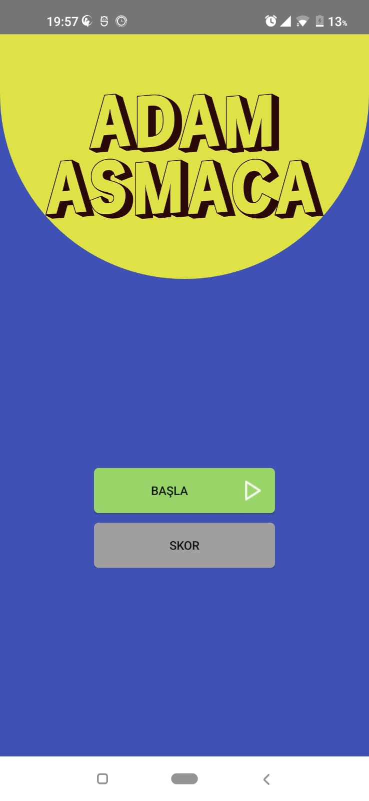
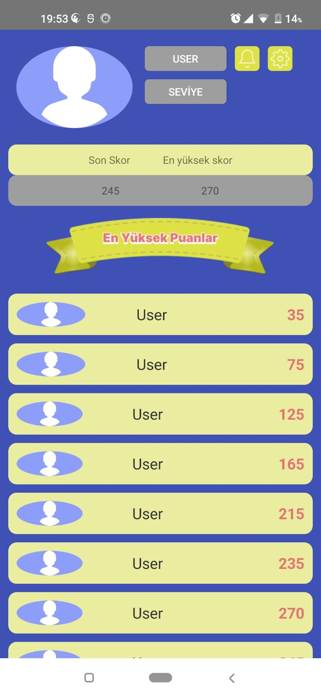
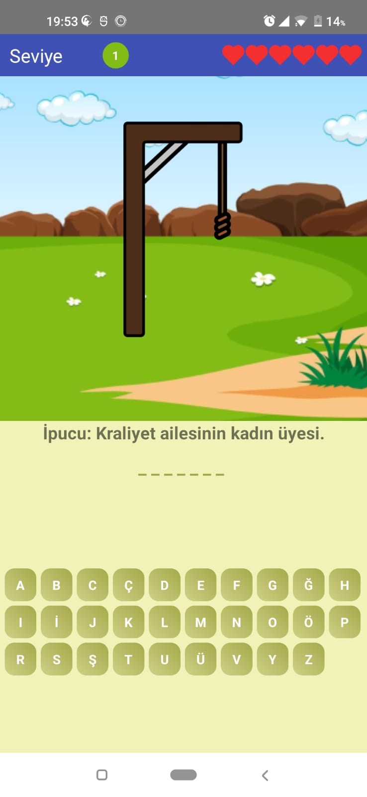
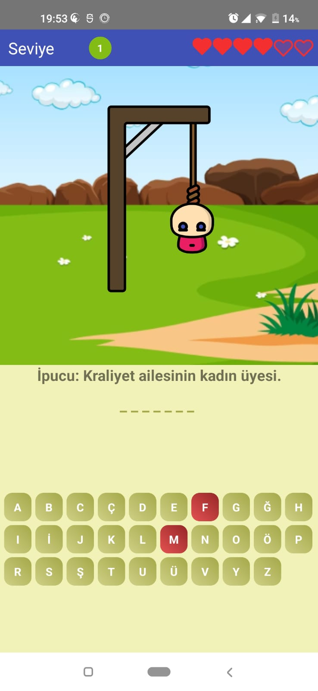
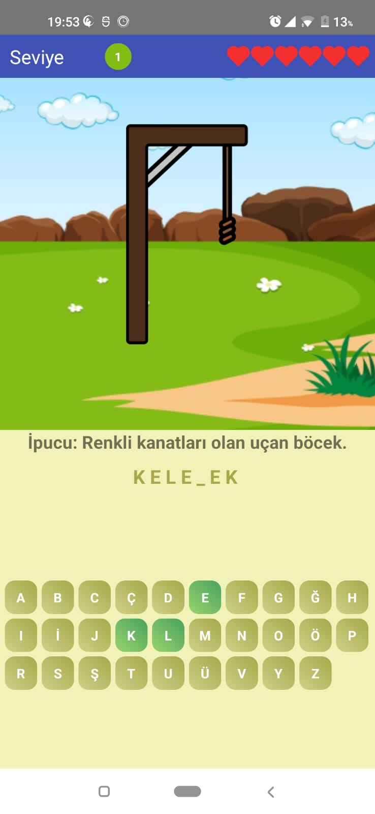
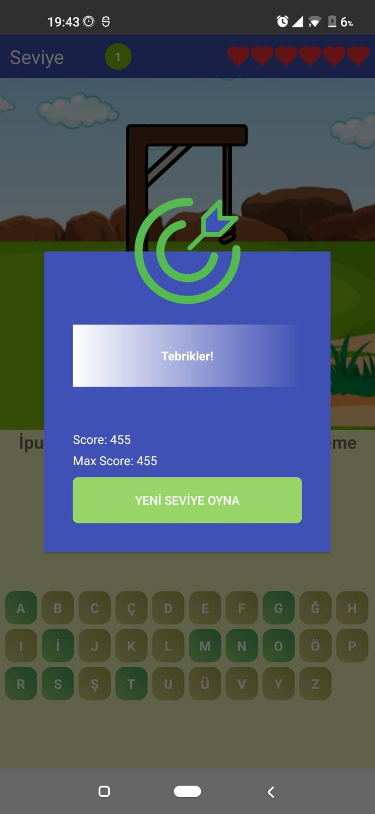
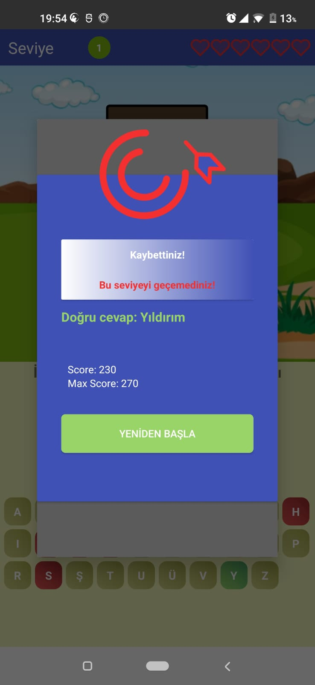

# Hangman Game - Kotlin

This project is an ongoing development of a hangman game implemented in Kotlin. The game is based on guessing a word letter by letter. With each incorrect guess, a part of the hangman is drawn. The player has a limited number of incorrect guesses, and when they run out, the game ends.

## Features
- Guess the word letter by letter
- Limited number of incorrect guesses
- Visual representation of the hangman
- Dialogs for game start, success, and failure
- Score tracking

## Architecture
This project is designed using the **MVVM (Model-View-ViewModel)** architecture. MVVM helps in separating concerns within the application, making it more manageable and testable. Here’s a brief overview of how MVVM is implemented.

## Libraries and Tools Used
- **Firebase Realtime Database**
- **Navigation Component**
- **Lifecycle Components**
- **Hilt**
- **Room**
- **Coroutines**

## Screenshots

    
    
    
    
    
    
    

