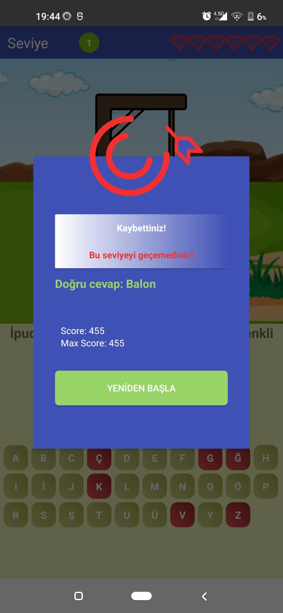

# Hangman Game - Kotlin

This project is an ongoing development of a hangman game implemented in Kotlin. The game is based on guessing a word letter by letter. With each incorrect guess, a part of the hangman is drawn. The player has a limited number of incorrect guesses, and when they run out, the game ends.

## Features
- Guess the word letter by letter
- Limited number of incorrect guesses
- Visual representation of the hangman
- Dialogs for game start, success, and failure
- Score tracking

## Screenshots

